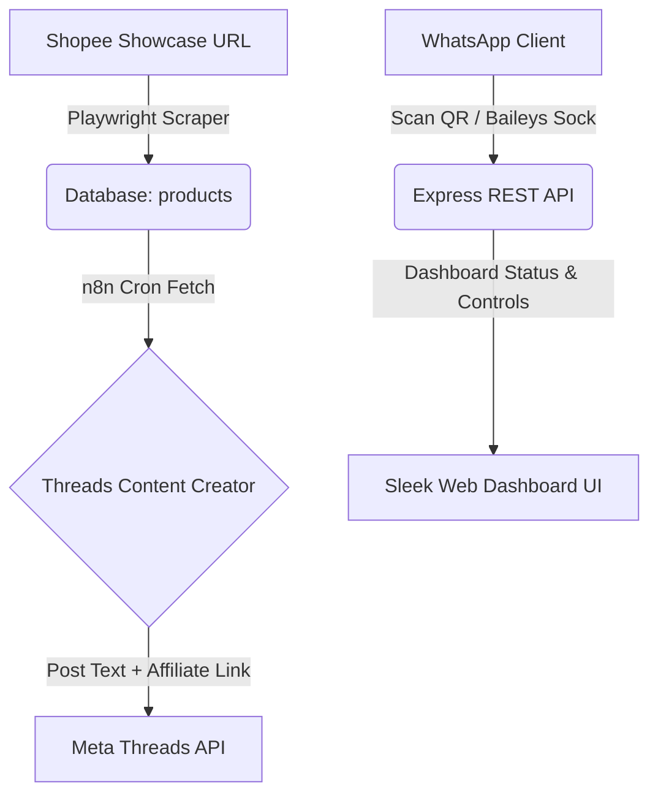

# ⚡ Traffic Harvester — WhatsApp Bot & Shopee Showcase Scraper

A robust, premium automated affiliate marketing engine that connects your WhatsApp bot, Shopee showcases, and n8n production workflows. The project features a Playwright-core scraping agent, multi-device Baileys WhatsApp integration, and a modern, state-of-the-art web administration dashboard.

---

## 🚀 Key Features

*   **📱 WhatsApp Bot Hub (Baileys):** Real-time WhatsApp listener with Whitelisting (`OWNER_NUMBER`), live status tracking, active QR code generator, and instant session management (with a Disconnect Bot button).
*   **🛒 Showcase Scraper (Playwright):** Smart crawler designed for dynamic **ReactVirtualized** showcase lists. Automatically scrolls container viewports, collects items incrementally as they render in DOM, and syncs Shopee products cleanly without duplicates.
*   **📊 Premium Dashboard (SPA UI):** Sleek, modern dark-themed web administration console:
    *   **Live Status Monitoring:** Pulse-indicator showing connection states ("Connected", "Connecting...", "Disconnected").
    *   **Product Monitor:** Multi-tab product catalog ("Semua", "Belum Post", "Sudah Post") with Google Drive download link thumbnail parser and custom delete triggers (🗑️).
    *   **Showcase Manager:** Manage targets and triggers directly from the interface.
*   **🐘 Supabase PostgreSQL Drizzle ORM:** Connection-pooled persistence with automatic failover (IPv4 transaction poolers).
*   **🔗 n8n Production Bridge:** Exponential backoff retry logic, webhook heartbeat validations, and zero-image fast-threads posting integrations.

---

## 🏗️ Architecture Flow



---

## 🔧 Environment Variables (.env)

Traffic Harvester is highly portable and can easily be deployed to **Railway, Render, VPS, or a local Docker container**. Simply duplicate `.env.example` as `.env` and configure:

| Key | Description | Example / Default |
| :--- | :--- | :--- |
| `PORT` | Web port of the Dashboard and APIs | `3000` |
| `DATABASE_URL` | PostgreSQL direct or pooler connection URL | `postgresql://...` |
| `OWNER_NUMBER` | Whitelisted phone number in full international format | `6281228264631@s.whatsapp.net` |
| `N8N_WEBHOOK_URL` | Endpoint of the n8n WhatsApp messages webhook | `https://n8n.domain.app/webhook/...` |
| `BOT_NAME` | Identity string shown in logs and console | `Iman Bot` |
| `JWT_SECRET` | Secret key used to encrypt Dashboard JWT sessions | `traffic-harvester-secure-key` |
| `LOG_LEVEL` | Level of application logging verbosity | `info` |

---

## 📦 Deployment Guides

### Option A: Railway (Current Setup)
1. The repository is configured to build using `Dockerfile` automatically.
2. Railway maps exposed container ports dynamically using the `PORT` environment variable.
3. Make sure the volume is mounted at `/app/auth_info_baileys` to persist the WhatsApp QR-code session state.

### Option B: VPS Setup (PM2 & Node)
1. Clone the repository to your VPS:
   ```bash
   git clone <repository_url> && cd iman-wa-bot
   ```
2. Copy and configure variables:
   ```bash
   cp .env.example .env
   nano .env
   ```
3. Install production dependencies and compile TypeScript:
   ```bash
   npm install
   npm run build
   ```
4. Run migrations using drizzle:
   ```bash
   npm run db:migrate
   ```
5. Start the system via PM2:
   ```bash
   pm2 start dist/index.js --name "traffic-harvester"
   ```

### Option C: Docker Compose (Fully Isolated Container)
1. Build and boot the stack:
   ```bash
   docker-compose up -d --build
   ```
2. The dashboard is accessible at `http://localhost:3000` (or your VPS IP address).
3. The Baileys WhatsApp credential storage is safely saved in the host volume `/auth_info_baileys`.

---

## 🧹 Database Management

To clear out posted items or sync showcase modifications, you can use the web interface's product catalog.
*   Click **🗑️** on any item card: This executes a `DELETE /api/products/:id` request, deleting the database item instantly and updating dashboard stats live.
*   New scraper runs automatically use an **upsert strategy (`onConflictDoUpdate`)**, ensuring that any existing product details are updated without losing their `isPosted` status, preventing duplicate threads posts!

---

## 📄 License & Maintainer

Developed by **Iman Bot Studio** — Engineered for premium, state-of-the-art affiliate automation.
